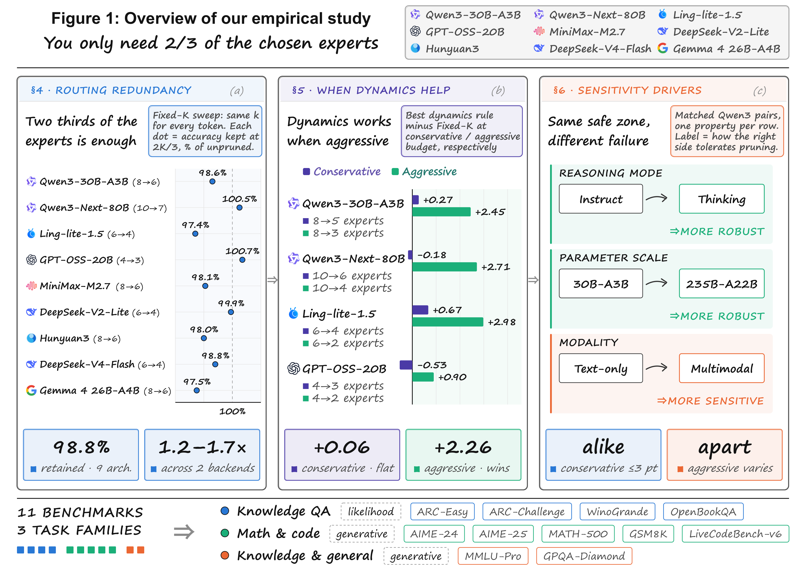
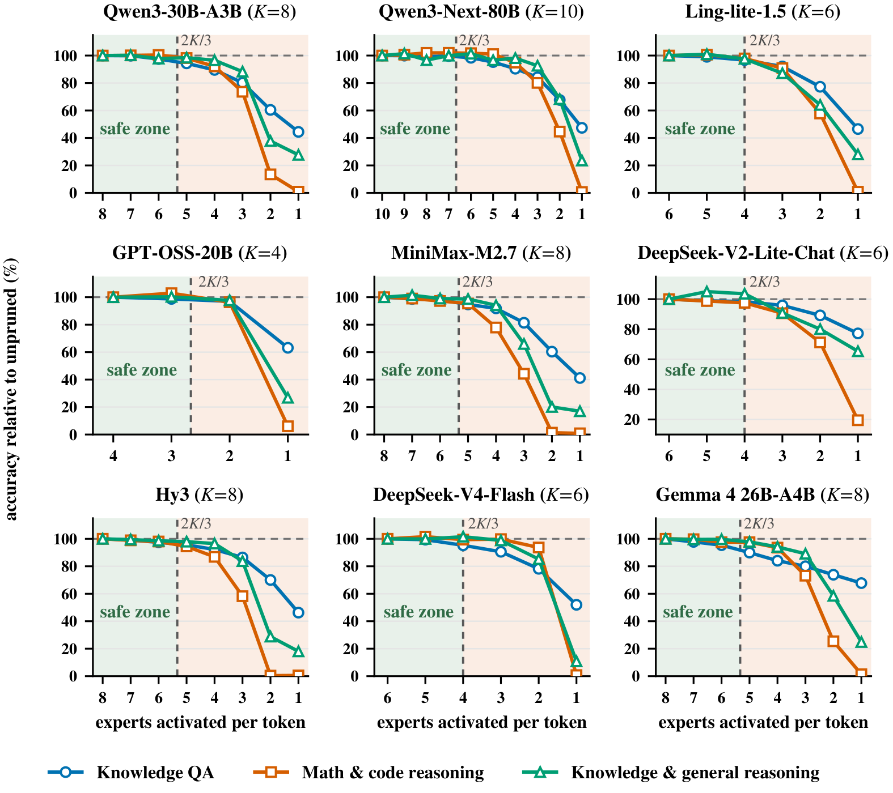
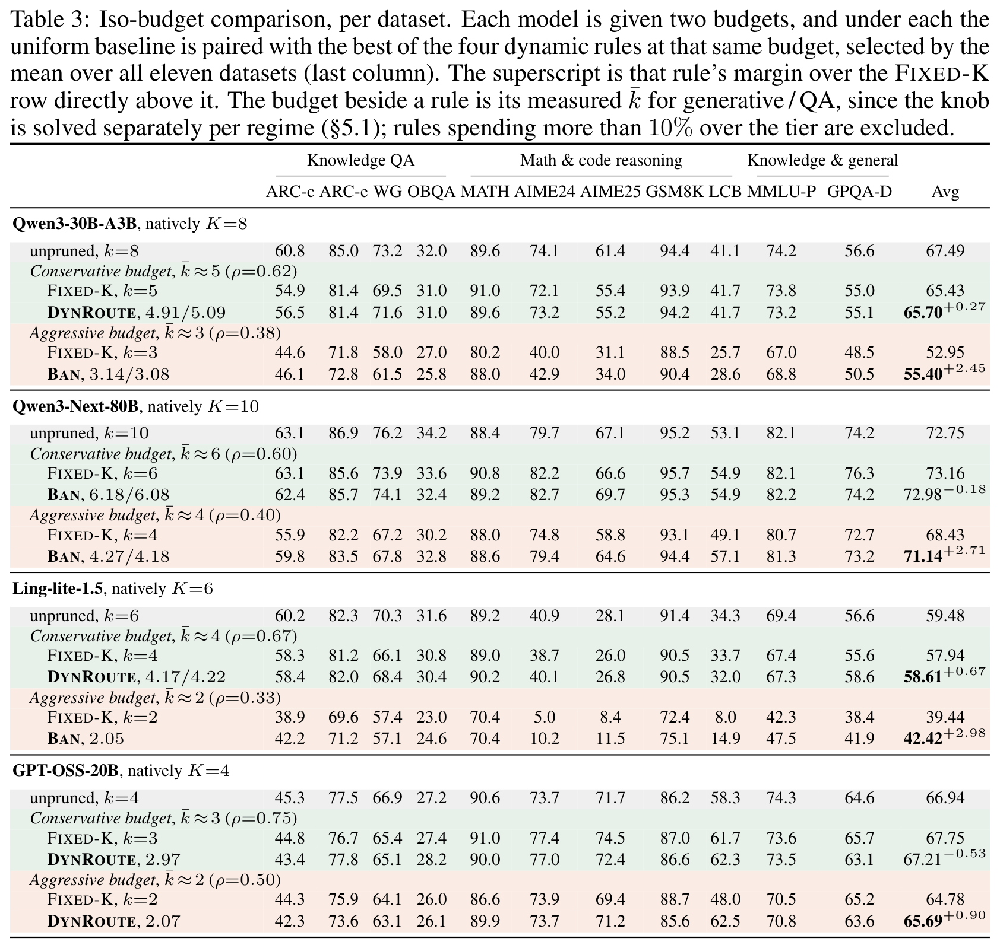
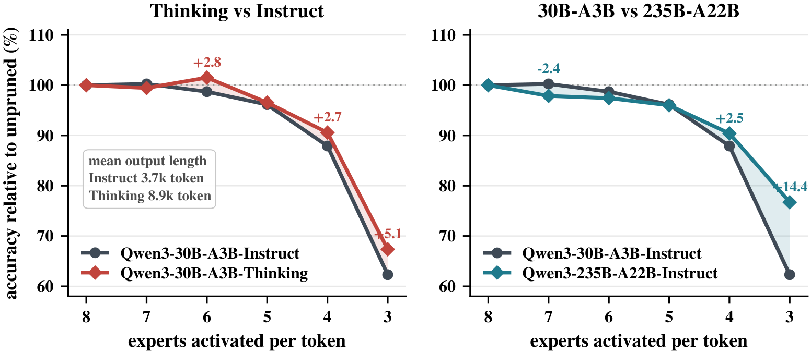
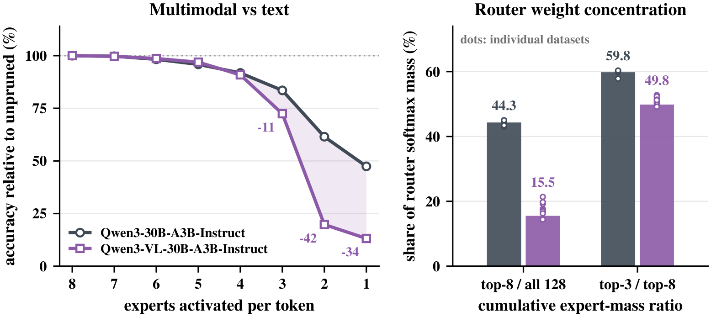

# An Empirical Study on Expert Pruning

[](https://arxiv.org/abs/2609.25809)
[](LICENSE)

> **[You Only Need 2/3 of the Chosen Experts: An Empirical Study of Dynamic Expert
> Pruning in Fine-Grained MoE LLMs](https://arxiv.org/abs/2609.25809)**
>
> [中文说明 / Chinese README](docs/README.zh-CN.md)

Code and results for a study of **inference-time expert pruning in fine-grained
Mixture-of-Experts LLMs**: how redundant per-token expert selection really is,
how well existing pruning rules exploit that redundancy, and what governs a
model's sensitivity to pruning.

Twelve checkpoints across nine architecture families, eleven benchmarks in three
task families. Everything is measured on unmodified released checkpoints — no
fine-tuning, no distillation, no weight surgery. Only the number of experts
activated per token changes.



## Headline

| | |
|---|---|
| **You only need 2/3 of the chosen experts.** | Keeping `⌈2K/3⌉` of them preserves **98.8 %** of unpruned performance, averaged over nine models and three task families. |
| **It is a one-integer change.** | No fine-tuning, no calibration, no weight surgery — and **1.2–1.7×** faster on two serving backends. |
| **Adaptive rules only pay off when you push hard.** | At conservative budgets they beat uniform truncation by **+0.06** on average. Under aggressive pruning, by **+2.26**. |
| **Sensitivity belongs to the model, not the budget.** | Larger and reasoning-tuned models are more resilient; multimodal models are markedly more fragile. |

Six of the twenty-seven model-by-family combinations match or beat their own
unpruned score at the 2/3 budget. Nothing about the checkpoint changes — only
how many experts each token is allowed to use.

Accuracy retained at the 2/3 budget, per architecture:

| | Model | Total | Active | Experts | Selected | native → pruned | retained |
|---|---|---:|---:|---:|---:|:---:|:---:|
|  | [GPT-OSS-20B](https://huggingface.co/openai/gpt-oss-20b) | 21 B | 3.6 B | 32 | 4 |  |  |
|  | [Qwen3-Next-80B-A3B](https://huggingface.co/Qwen/Qwen3-Next-80B-A3B-Instruct) | 80 B | 3 B | 512 | 10 |  |  |
|  | [DeepSeek-V2-Lite-Chat](https://huggingface.co/deepseek-ai/DeepSeek-V2-Lite-Chat) | 15.7 B | 2.4 B | 64 | 6 |  |  |
|  | [DeepSeek-V4-Flash-0731](https://huggingface.co/deepseek-ai/DeepSeek-V4-Flash) | 165 B | 11.5 B | 256 | 6 |  |  |
|  | [Qwen3-30B-A3B-Instruct](https://huggingface.co/Qwen/Qwen3-30B-A3B-Instruct-2507) | 30.5 B | 3.3 B | 128 | 8 |  |  |
|  | [MiniMax-M2.7](https://huggingface.co/MiniMaxAI/MiniMax-M2.7) | 229 B | 11 B | 256 | 8 |  |  |
|  | [Hunyuan3](https://huggingface.co/tencent/Hy3) | 295 B | 21 B | 192 | 8 |  |  |
|  | [Gemma 4 26B-A4B](https://huggingface.co/google/gemma-4-26B-A4B) | 25.2 B | 3.8 B | 128 | 8 |  |  |
|  | [Ling-lite-1.5-2507](https://huggingface.co/inclusionAI/Ling-lite-1.5) | 16.8 B | 2.75 B | 64 | 6 |  |  |

*Total* and *Active* are parameter counts, *Experts* is the routed experts per
layer and *Selected* is how many of them the router natively activates per token.
Shared experts, which every token passes through regardless, are excluded from
both expert columns: Qwen3-Next-80B, Hunyuan3, DeepSeek-V4-Flash and Gemma 4 have
one each, Ling-lite-1.5 and DeepSeek-V2-Lite have two, the rest none.

The eleven benchmarks, in three families:

| Family | Scoring | Benchmarks |
|---|---|---|
| Knowledge QA | log-likelihood, zero-shot | ARC-Easy, ARC-Challenge, WinoGrande, OpenBookQA |
| Mathematical and code reasoning | generative | AIME-24, AIME-25, MATH-500, GSM8K, LiveCodeBench-v6 |
| Knowledge and general reasoning | generative | MMLU-Pro, GPQA-Diamond |

## Methods

Every rule keeps all experts resident and changes only how many of the selected
ones each token evaluates. All of them are re-implemented against the same router
patch, so no part of the comparison is explained by differing harnesses.

`--expert_pruning_method` picks one:

| Method | Retention decided by | Layer budget | Needs calib. | k floor | Knob | Paper |
|---|---|:---:|:---:|:---:|---|---|
| **Fixed-K** (baseline) | a constant k for all tokens | no | no | — | `--num_experts_per_tok` | this study |
| **NAEE** | gate weight relative to the top-1 expert | no | no | 2 | `--naee_beta` | [ACL 2024](https://aclanthology.org/2024.acl-long.334/) |
| **Dynamic Routing** | cumulative retained probability mass | no | no | — | `--dynamic_routing_threshold` | [ACL 2024](https://aclanthology.org/2024.acl-long.696/) |
| **DiEP** | top-1 ratio scaled by expert similarity | no | **yes** | 2 | `--naee_beta`, `--diep_artifact_path` | [NeurIPS 2025](https://doi.org/10.52202/085713-1878) |
| **Ban** | layer sensitivity plus token sensitivity | **yes** | **yes** | 3 | `--ban_lambda`, `--ban_artifact_path` | [EMNLP 2026](https://arxiv.org/abs/2509.06346) |

Two further published rules are implemented and selectable but sit outside the
matched-budget comparison, because they prune on a different axis:
**MC-MoE** ([ICLR 2025](https://proceedings.iclr.cc/paper_files/paper/2025/hash/abc1943857a42935ceacff03c524bb44-Abstract-Conference.html))
protects important tokens via attention sinks before thresholding, and
**EAC-MoE** ([ACL 2025](https://aclanthology.org/2025.acl-long.633/)) restricts
pruning to prefill and decides from per-expert traffic. Several layer-budget
variants (`TopK_Biased_Renorm`, `LayerWise_Dynamic_Routing`,
`Budget_Dynamic_Routing`, …) are ours; run `python main.py --help` for the list.

Every knob, what it does and how to choose it:
[**docs/hyperparameters.md**](docs/hyperparameters.md).

**Which models the adaptive rules work on.** All of them need
`--use_local_expert_router`, which patches vLLM's fused top-k routing, and that
patch recognises four architectures: Qwen3-30B-A3B, Qwen3-Next-80B, Ling-lite-1.5
and GPT-OSS-20B. On anything else it refuses to start rather than silently
leaving the model unpruned:

```
RuntimeError: Expert pruning cannot intercept expert selection for MoE layer ...
```

DeepSeek-V2-Lite is one such case, which is why the paper reports it under
Fixed-K only. Fixed-K has no such limit — it is a config overlay, so it works on
any MoE the engine can load.

That difference is also why there are two install paths rather than one; see
[Two environments](#two-environments) below.

## Results

### 1. How much routing does a fine-grained MoE need?

Fixed-K across nine architectures. The shaded band is the safe zone down to the
2/3 budget; the three curves are the task families. **Knowledge QA is the last to
fall on every model, and math and code reasoning is the first**:



The full sweep — every budget on every dataset — is in
[`docs/expert_pruning_results.md`](docs/expert_pruning_results.md) and in the
per-model tables under [`results/`](results).

### 2. When does dynamic allocation beat uniform pruning?

[Table 3 of the paper](https://arxiv.org/abs/2609.25809). Each model gets two
budgets, and under each one the uniform baseline is paired with whichever of the
four dynamic rules does best **at that same measured budget**:



Read down the superscripts. At the conservative budget the margins run from
`-0.53` to `+0.67`, averaging **+0.06** — uniform truncation has already caught up
with the best rule, so the machinery buys nothing. Tighten the budget and every
model flips: **+2.45**, **+2.71**, **+2.98**, **+0.90**, averaging **+2.26**.
Knowing *which* experts to drop only starts paying once few enough are left that
the choice matters.

Per-rule, per-dataset detail at both budgets:
[`docs/expert_pruning_results.md`](docs/expert_pruning_results.md) and
[`docs/qa_summary.md`](docs/qa_summary.md).

### 3. What governs sensitivity to pruning?

Holding everything else fixed, a reasoning-tuned variant is more robust than its
instruct sibling, and a larger model is more robust than a smaller one from the
same family — and **the gap only opens once the budget gets aggressive**:



Multimodality runs the other way, and the router explains why. The VL model
spreads far less of its softmax mass over the experts it selects, so there is
much less redundancy to remove:



The router statistics behind the right panel are in
[`docs/router_distribution.md`](docs/router_distribution.md).

### Per-model result tables

| Model | Methods covered |
|---|---|
| [Qwen3-30B-A3B-Instruct](results/Qwen3-30B-A3B-Instruct-2507/RESULTS.md) | all rules, both budgets |
| [Qwen3-Next-80B-A3B](results/Qwen3-Next-80B-A3B-Instruct/RESULTS.md) | all rules, both budgets |
| [Ling-lite-1.5-2507](results/Ling-lite-1.5-2507/RESULTS.md) | all rules, both budgets |
| [GPT-OSS-20B](results/gpt-oss-20b/RESULTS.md) | all rules, both budgets |
| [MiniMax-M2.7](results/MiniMax-M2.7/RESULTS.md) | Fixed-K sweep |
| [DeepSeek-V2-Lite-Chat](results/DeepSeek-V2-Lite-Chat/RESULTS.md) | Fixed-K sweep |
| [DeepSeek-V4-Flash-0731](results/DeepSeek-V4-Flash-0731/RESULTS.md) | Fixed-K sweep |
| [Hunyuan3](results/Hy3/RESULTS.md) | Fixed-K sweep |

Gemma 4 26B-A4B is in the paper's Fixed-K sweep and in the table above, but its
per-model page is not in the repository yet, though its ladder is reproducible
like any other. The three single-factor checkpoints behind the
matched-pair and modality figures — Qwen3-30B-A3B-Thinking, Qwen3-235B-A22B and
Qwen3-VL-30B-A3B — are likewise reported in the paper without a page here.

## Two environments

There are two install scripts, and which one you want depends only on the model.

| | `install_expertpruning.sh` | `install_fixedk.sh` |
|---|---|---|
| **What it runs** | every method, including the adaptive rules | Fixed-K only |
| **vLLM** | v0.10.2, submodule, **editable** | 0.28.0, released wheel, not editable |
| **torch** | 2.8.0+cu128 (pinned by that wheel) | 2.13.0+cu130 |
| **transformers** | 4.57.6 (pinned) | 5.17.0 (resolved by vLLM) |
| **Models** | Qwen3-30B-A3B, Qwen3-Next-80B, Ling-lite-1.5, GPT-OSS-20B, … | DeepSeek-V4-Flash, Hunyuan3, MiniMax-M2.7, Gemma 4, Qwen3.5, … |

DeepSeek-V2-Lite is old enough for both engines to load and is Fixed-K only, so
it runs in either; `scripts/run.sh` knows which models are which and checks
before it starts anything.

The two are independent: installing one never touches the other.

<details>
<summary><b>Why not one environment?</b></summary>

The adaptive rules replace vLLM's fused routing kernel, so that environment has
to keep vLLM editable, and therefore pinned. A pinned engine cannot load model
architectures released after it.

Fixed-K needs no engine change at all. It rewrites `num_experts_per_tok` in a
config-only overlay and lets the model's own router select the top-K it had
already ranked, so that environment is free to follow vLLM releases — which is
what makes the newer checkpoints reachable at all.

The split is not about which pruning rule is interesting. It is that a patched
engine cannot also be a current engine.

</details>

## Install

Both scripts refuse to run outside an isolated environment, and both check that
the package indexes they need are reachable before downloading the ~20 GB that
takes 35 to 40 minutes.

```bash
git clone --recurse-submodules https://github.com/MingZwhy/An-Empirical-Study-on-Expert-Pruning.git
cd An-Empirical-Study-on-Expert-Pruning
```

**All methods** (editable vLLM v0.10.2):

```bash
conda create -y -n expertpruning python=3.12 && conda activate expertpruning
bash install_expertpruning.sh
```

**Fixed-K on newer architectures** (released vLLM 0.28.0):

```bash
conda create -y -n fixedk python=3.12 && conda activate fixedk
bash install_fixedk.sh
```

A `venv` works just as well as conda.

Both scripts declare the versions that have to hold and let the resolver pick the
rest, so a little drift from the table above is normal and does not invalidate
anything — the study's conclusions do not rest on a byte-identical environment.

Each script ends with a self-check that asserts the versions it depends on, that
vLLM is editable exactly where it must be, and that the model registry contains
the architectures the environment is for.

### Checking your own install

Do not check a score. At a handful of samples an accuracy is noise, and a pruning
rule that failed to engage produces a perfectly respectable one — that is the whole
problem with it.

Check the average number of experts each token actually kept. That number cannot
be faked by a broken setup: a patch that never attached reports the model's native
`k`, a threshold that is too aggressive sits pinned to the `k_min` floor, and only
a working chain — patch attached, threshold interpreted, counters alive — lands
near the published value. Two minutes on two GPUs:

```bash
export MODELS_DIR=$HOME/models
EP_GEN_DATASETS=gsm8k bash scripts/run.sh qwen3-30b dynamic_routing \
    --only thr0.8 --smoke --gpus 0,1

grep 平均专家选择数 local_logs/Qwen3-30B-A3B-Instruct-2507/*.generative.log
```

Against a native `k` of 8, and the
[published sweep](results/Qwen3-30B-A3B-Instruct-2507/RESULTS.md):

| Configuration | published | our run |
|---|---:|---:|
| Dynamic Routing, threshold 0.8 | 5.918 | 5.936 |
| NAEE, β=0.35, k_min=2 | 6.408 | 6.456 |

Anything within a tenth or so is the right answer. The quantity travels between
datasets because it depends on the shape of the router's weight distribution rather
than on the questions, which is why four GSM8K samples can be compared against a
nine-dataset sweep at all. A reading of exactly 8.000, or none at all, means the
rule is not running; see
[the diagnostics section](docs/hyperparameters.md#checking-that-pruning-actually-happened).

## Quickstart

`main.py` is the single entry point for every harness and every method. Point
`--model_path` at a local checkpoint directory.

Tensor parallel defaults to however many GPUs are visible, so on a large host set
`CUDA_VISIBLE_DEVICES` before you start — otherwise these commands try to shard a
30B model across all of them and fail in engine init.

```bash
export CUDA_VISIBLE_DEVICES=0,1

# unpruned baseline
python main.py --datasets gsm8k --max_samples 8 --model_path <model>

# Fixed-K: keep the 4 highest-scoring experts per token
python main.py --datasets gsm8k --max_samples 8 --num_experts_per_tok 4 --model_path <model>

# log-likelihood multiple choice: nothing is generated, so pruning is measured
# without "did the model stop cleanly" as a confound
python main.py --harness lm_eval --lm_eval_tasks arc_challenge --max_samples 8 --model_path <model>
```

That is the whole of Fixed-K: one integer, no engine patch. The adaptive rules
additionally need the router patch, so they only run in the `expertpruning`
environment:

```bash
# Dynamic Routing: keep the shortest expert prefix reaching a probability mass
python main.py --datasets gsm8k --max_samples 8 --model_path <model> \
    --use_local_expert_router --enforce_eager \
    --expert_pruning_method Dynamic_Routing \
    --dynamic_routing_threshold 0.8 --dynamic_routing_score_source renormalized

# Ban: offline layer sensitivity combined with online token sensitivity
python main.py --datasets gsm8k --max_samples 8 --model_path <model> \
    --use_local_expert_router --enforce_eager \
    --expert_pruning_method Ban \
    --ban_artifact_path calib_utils/results/<model-dir-name>/c4_ban.pt \
    --ban_lambda 0.7 --ban_k_min 3
```

**`--enforce_eager` is not optional here.** Expert selection gets inlined into the
compiled region, `torch.compile` traces the counters away, and the average number
of experts retained becomes unobservable. Pruning still happens — only the
measurement is lost — but that average is the axis every comparison in this study
is matched on, so `main.py` stops rather than report a number it cannot stand
behind. Quantized models are the exception: eager costs 6.7× throughput on
gpt-oss, so there the score comes from a CUDA-graph run
(`--allow_compiled_router`) and the expert count from a separate eager probe.

Add `--expert_pruning_debug` to see the retained average as it is counted. It is
worth a look: a rule that failed to engage reads as unusually good accuracy, not
as an error.

Every flag, what it does and how to choose it:
[**docs/hyperparameters.md**](docs/hyperparameters.md).

## Reproducing the study

One entry point drives every sweep. It needs a directory of checkpoints and
nothing else:

```bash
export MODELS_DIR=$HOME/models

bash scripts/run.sh list                    # models and their stages
bash scripts/run.sh qwen3-30b all           # one model, every method the paper reports
bash scripts/run.sh all                     # the whole study, cheapest model first
```

Nine models, named as below or by any unambiguous prefix. The four that carry every
adaptive rule are the four the router patch covers; the rest are Fixed-K, which
needs no engine patch and so runs on anything the engine loads.

| | Methods | GPUs | Environment |
|---|---|:---:|---|
| `qwen3-30b` | every rule | 2 | `expertpruning` |
| `qwen3-next` | every rule | 4 | `expertpruning` |
| `ling-lite` | every rule | 2 | `expertpruning` |
| `gpt-oss` | every rule | 2 | `expertpruning` |
| `deepseek-v2` | Fixed-K | 2 | either |
| `gemma-4` | Fixed-K | 2 | `fixedk` |
| `deepseek-v4` | Fixed-K | 4 | `fixedk` |
| `minimax` | Fixed-K | 8 | `fixedk` |
| `hunyuan3` | Fixed-K | 16 | `fixedk` |

The GPU count is what the published runs used; `--gpus` overrides it and tensor
parallel follows. `run.sh` checks the active environment against the model's before
starting anything, because getting that pair wrong otherwise surfaces as an obscure
engine error.

### One model, end to end

Everything the paper reports for a model lives in one directory:

```
scripts/models/qwen3-30b-a3b-instruct-2507/
    model.env             native k=8, the dataset list, sampling, tensor parallel
    baseline.sh           the released checkpoint, nothing overridden
    fixedk.sh             k = 7, 6, 5, 4, 3, 2, 1
    naee.sh               gate weight against the top-1 expert
    dynamic_routing.sh    shortest expert prefix reaching a probability mass
    diep.sh               NAEE scaled by calibrated expert similarity
    ban.sh                layer sensitivity plus token sensitivity
    mc_moe.sh eac_moe.sh  implemented, outside the matched-budget comparison
    qa.sh                 the four log-likelihood multiple-choice sets
    calibrate.sh          the one C4 pass that Ban and DiEP read
```

Look before you run. `--dry-run` needs neither a GPU nor a checkpoint:

```console
$ bash scripts/run.sh qwen3-30b ban --dry-run

== Qwen3-30B-A3B-Instruct-2507 :: Ban ==
   checkpoint  $MODELS_DIR/Qwen3-30B-A3B-Instruct-2507
   results     results/Qwen3-30B-A3B-Instruct-2507/
   gpus        all (tensor parallel 2)
   dry run: nothing will be executed

  # Ban-kmin3-lambda0.95
  python main.py \
      --model_path $MODELS_DIR/Qwen3-30B-A3B-Instruct-2507 \
      --datasets mmlu_pro,gpqa:diamond,math_500,aime24_avg,... \
      --max_model_len 32768 --max_new_tokens 32768 \
      --temperature 0.7 --top_p 0.8 --top_k 20 \
      --use_local_expert_router \
      --expert_pruning_method Ban --ban_lambda 0.95 --ban_k_min 3 \
      --ban_artifact_path calib_utils/results/.../c4_ban.pt \
      --output_dir results/Qwen3-30B-A3B-Instruct-2507/Ban-kmin3-lambda0.95
  ...
```

Then a sequence that costs about a day on two GPUs:

```bash
bash scripts/run.sh qwen3-30b calibrate --gpus 0,1        # once; Ban and DiEP read this
bash scripts/run.sh qwen3-30b baseline fixedk --gpus 0,1  # the reference and the ladder
bash scripts/run.sh qwen3-30b ban dynamic_routing --gpus 0,1
bash scripts/run.sh qwen3-30b qa --gpus 0,1               # the four multiple-choice sets
```

Results land in `results/<model>/<configuration>/`, logs in `local_logs/`. A
configuration that already has results is skipped, so an interrupted sweep
resumes by re-running the same command.

**GPQA is handled for you.** It is gated on the Hub and is in every model's
dataset list, so the first generative stage that needs it fetches it — 2.3 MB from
the authors' own archive, no account, a few seconds — and says so:

```
[preflight] gpqa:diamond is gated on the Hub and no local copy is present; fetching it
            from the authors' archive instead (2.3 MB, no account needed).
[preflight] done; reading GPQA from data/gpqa/
```

Nothing to do about it, and nothing to do again: the copy lands in `data/gpqa/`,
which is gitignored. If you would rather use the Hub, accept the gate and
authenticate and that is used instead — approval there is automatic, not a review
queue. `EP_NO_AUTO_FETCH=1` turns the fetching off and explains the options, and
`python scripts/fetch_gpqa.py` does it explicitly, which is what you want when the
machine that runs the sweep has no outbound network.

This repository does not carry the questions, and will not. The terms attached to
the dataset ask that its examples not appear in plain text online, to keep them out
of training corpora — and a benchmark this study's own numbers rest on is not one to
help contaminate. The authors' archive respects that: a password-protected zip is
not crawlable text, which is the point of it.

There are open mirrors, and this deliberately does not use one. They are
reformatted — the ones with the right 198 rows collapse the three wrong answers
into a single solution string, so they cannot reproduce a four-way multiple choice,
and swapping one in would quietly change what the benchmark measures. The other ten
benchmarks are ungated.

Two options are worth knowing before you spend GPU hours: `--smoke` shrinks every
run to a few samples and short generations, and `--only` picks one configuration
out of a stage.

```bash
bash scripts/run.sh qwen3-30b baseline fixedk --smoke --gpus 0,1
bash scripts/run.sh qwen3-30b fixedk --only k6 --gpus 0,1
```

### Reading a configuration

The scripts are meant to be read. `ban.sh` is a list of configurations, one per
line:

```bash
# matched to Fixed-K k=6
ep_run Ban-kmin3-lambda0.95 \
    --use_local_expert_router --expert_pruning_method Ban --ban_lambda 0.95 --ban_k_min 3 \
    --ban_artifact_path "$(ep_artifact ban)"
```

`Ban-kmin3-lambda0.95` is both the output directory and the row label in
[`results/Qwen3-30B-A3B-Instruct-2507/RESULTS.md`](results/Qwen3-30B-A3B-Instruct-2507/RESULTS.md),
so a line in the script and a row in the table are the same run. The comment
records which Fixed-K budget that `lambda` was solved to match; comparing rules
at their default knobs would measure nothing, since a rule that keeps more
experts will score better.

To check the scripts themselves, without a GPU or a checkpoint:

```bash
python scripts/check_sweep_scripts.py
```

It dry-runs all 294 configurations and validates every emitted flag against
`main.py`'s parser. More detail in [`scripts/README.md`](scripts/README.md).

## Layout

```
main.py                       single entry point for every harness and method
install_expertpruning.sh      environment 1: all methods, editable vLLM v0.10.2
install_fixedk.sh             environment 2: Fixed-K, released vLLM 0.28.0

expert_pruning/               the implementation
  routing.py                    the pruning rules
  vllm_patch.py                 replaces vLLM's fused top-k router
  config_shims.py               Fixed-K config overlays
calib_utils/                  calibration passes for Ban and DiEP
tasks/, tasks_lm_eval/        task definitions added on top of the harnesses

scripts/
  run.sh                        one entry point for every sweep
  models/<model>/               per model: every method, every budget
  lib/common.sh                 shared plumbing for those scripts
  check_sweep_scripts.py        validates them without a GPU
  report_*.py, plot_*.py        tables and figures from raw runs
  bench_*.py, solve_*.py        speed benchmarks, knob solvers

docs/
  hyperparameters.md            every knob and how to choose it
  expert_pruning_results.md     the full sweep
  qa_summary.md                 the cross-model QA table
  known_issues.md               rough edges, written down rather than hidden
  vllm_install_notes.md         the ABI analysis behind the two environments
results/<model>/RESULTS.md     per-model tables
3rdparty/                     vLLM, lighteval, lm-evaluation-harness, lmms-eval
```

## Reproducibility notes

- **Harnesses are pinned as submodules.** `lighteval` is a fork carrying this
  project's patches — every one is tagged `[ExpertPruning-mod]` in its history.
  `lm-evaluation-harness` is upstream v0.4.13, unmodified.
- **Log-likelihood QA is scored as bare continuation**, no chat template, because
  the published numbers for those four sets are. Applying a template changes them
  and makes them incomparable.
- **Generation caching is fingerprinted on the pruning configuration**, so a
  sweep cannot silently replay samples generated under different settings. See
  [`docs/compact_cache_contamination.md`](docs/compact_cache_contamination.md).
- **Known rough edges** are written down rather than hidden:
  [`docs/known_issues.md`](docs/known_issues.md), and
  [`docs/vllm_install_notes.md`](docs/vllm_install_notes.md) for the torch/vLLM
  ABI analysis behind the two-environment split.
- Result tables state where a number was overridden by hand and why. Hunyuan3's
  FixedK-k2 MMLU-Pro and GSM8K entries, for example, are marked as not measured.

## License

[MIT](LICENSE). The vendored evaluation harnesses under
`3rdparty/` keep their own licenses, listed in [NOTICE](NOTICE).

## Citation

```bibtex
@misc{chen2026need23chosenexperts,
      title={You Only Need 2/3 of the Chosen Experts: An Empirical Study of Dynamic Expert Pruning in Fine-Grained MoE LLMs}, 
      author={Yuanteng Chen and Qiwei Lai and Chen Tianqi and Peisong Wang and Yuantian Shao and Nanxin Zeng and Zhilei Liu and Chuangyi Li and Jing Liu and Jian Cheng},
      year={2026},
      eprint={2609.25809},
      archivePrefix={arXiv},
      primaryClass={cs.LG},
      url={https://arxiv.org/abs/2609.25809}, 
}
```
